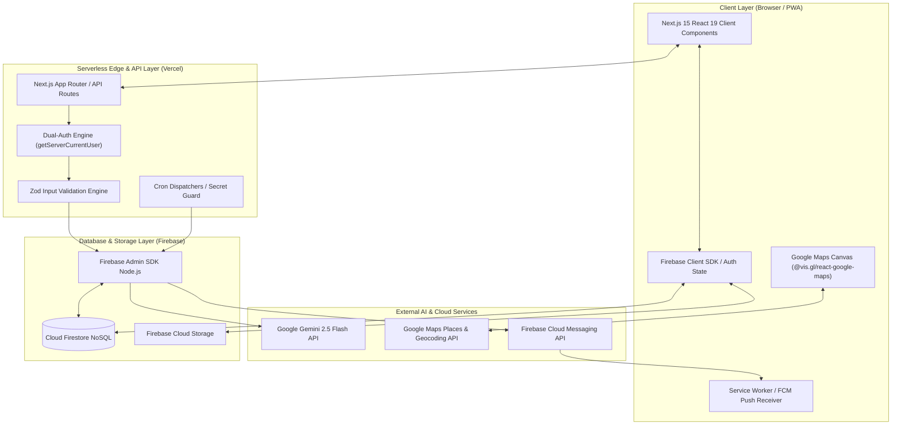
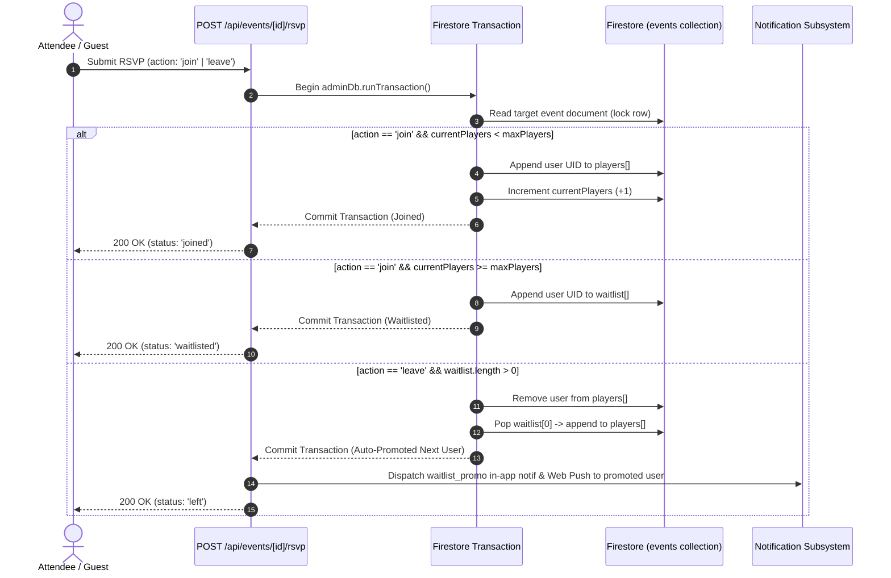

# HUDDLE SYSTEM MAP
**Visual Reference & Fast Architecture Guide**  
*Read Time: ~10 Minutes*  
*Target: Full-Stack Engineers & Technical Leads*

---

## 1. END-TO-END ARCHITECTURE DIAGRAM



---

## 2. DUAL-AUTH REQUEST FLOW

```
[ Incoming API Request ]
          │
          ▼
Does request have HTTP-only "session" cookie?
          ├─────────────────────────────┐
          ▼ (Yes)                       ▼ (No)
Verify via Firebase Admin         Does request have "Authorization: Bearer <token>"?
adminAuth.verifySessionCookie()         ├─────────────────────────────┐
          │                             ▼ (Yes)                       ▼ (No)
          │                       Verify via Firebase Admin     Reject Request
          │                       adminAuth.verifyIdToken()     Return 401 Unauthorized
          │                             │
          └──────────────┬──────────────┘
                         ▼
             [ Valid Decoded User Token ]
                         │
                         ▼
        Execute API Route Business Logic
```

---

## 3. CORE TRANSACTIONAL DATA FLOWS

### 3.1 RSVP & Waitlist Promotion Flow (`/api/events/[id]/rsvp`)


---

### 3.2 TerpLink Event Claiming Flow (`/api/events/claim`)
```
[ Scraped Event (isScraped: true, source: 'terplink') ]
                          │
                          ▼
            Organizer clicks "Claim Event"
                          │
                          ▼
      Submit edits to POST /api/events/claim
                          │
                          ▼
             Firestore Atomic Transaction
   ┌────────────────────────────────────────────────────────┐
   │ • Verify target event is unclaimed                     │
   │ • Update createdBy = Organizer UID                     │
   │ • Update organizerName = Organizer Display Name        │
   │ • Set source = 'claimed', claimedAt = Timestamp.now()  │
   │ • Merge Organizer into players[] via FieldValue        │
   │ • PRESERVE: players[], waitlist[], chat/, viewCount    │
   └──────────────────────┬─────────────────────────────────┘
                          │
                          ▼
[ Transferred Event: Verified & Managed with Zero Data Loss ]
```

---

## 4. FIRESTORE ENTITY RELATIONSHIP MAP

```
┌────────────────────────────────┐                 ┌────────────────────────────────┐
│             users              │                 │             events             │
├────────────────────────────────┤                 ├────────────────────────────────┤
│ uid (PK)                       │◄───────────────┐│ id (PK)                        │
│ email                          │                ││ createdBy (FK -> users.uid)    │
│ displayName                    │                ││ name / category / date / time  │
│ reliabilityScore: DERIVED ONLY │                ││ geopoint / geohash             │
│ accountType / verified         │                ││ maxPlayers / currentPlayers    │
│ favoriteSports: string[]       │                ││ players: [users.uid]           │
│ fcmTokens: string[]            │                ││ waitlist: [users.uid]          │
└───────────────┬────────────────┘                ││ source: 'manual'|'terplink'    │
                │ 1                               │└───────────────┬────────────────┘
                │                                 │                │ 1
                │ Subcollections                  │                │ Subcollections
    ┌───────────┴───────────┐                     │                ▼
    ▼                       ▼                     │┌────────────────────────────────┐
┌───────────────────────┐ ┌───────────────────────┐││          events/chat           │
│  users/notifications  │ │    users/following    ││├────────────────────────────────┤
├───────────────────────┤ ├───────────────────────┤││ id (PK)                        │
│ id (PK)               │ │ targetUid (PK->users) │││ senderId (FK -> users.uid)     │
│ type, message, read   │ │ timestamp             │││ text, timestamp, isAnnouncement│
│ eventId (FK->events)  │ └───────────────────────┘│└────────────────────────────────┘
└───────────────────────┘                          │
                                                   │
┌────────────────────────────────┐                 │
│  events/roster/{uid}  DENY-ALL │                 │
│  events/guestContacts DENY-ALL │                 │
├────────────────────────────────┤                 │
│ roster: note, answers, pickup  │                 │
│ Admin SDK only. events/{id} is │                 │
│ `allow read: if true` and rules│                 │
│ cannot project fields, so this │                 │
│ is the ONLY safe home for      │                 │
│ user-authored text.            │                 │
└────────────────────────────────┘                 │
                                                   │
┌────────────────────────────────┐                 │
│            reports             │                 │
├────────────────────────────────┤                 │
│ id (PK)                        │                 │
│ reporterId (FK -> users.uid)   │                 │
│ targetId (users.uid | event.id)├─────────────────┘
│ itemType, reason, status       │
└────────────────────────────────┘
```

---

## 5. COMPLETE API ROUTE MAP

| Method | Route | Auth Required | Transactional | Operational Purpose |
| :--- | :--- | :---: | :---: | :--- |
| `GET` | `/api/events` | None (public by design) | No | Event listing. Returns **only `PUBLIC_EVENT_FIELDS`** via `pickPublicFields()` — never the raw document |
| `GET` | `/api/events/[id]/attendees` | **Required** | No | The only route serving roster data. Organizer/admin get full detail; plain members get names only |
| `POST` | `/api/events` | **Required** | No | Create new event with Geohash computation |
| `POST` | `/api/events/[id]/rsvp` | **Required** — 401 for guests, no guest RSVP | **Yes** | Join, leave, waitlist, remove. Writes `roster/{uid}` in the same transaction. Rate limited 30/min |
| `POST` | `/api/events/[id]/view` | Public | Atomic Inc | Increment unique session view counter |
| `POST` | `/api/events/claim` | **Required** | **Yes** | Claim scraped event ownership in-place |
| `GET` | `/api/events/featured` | Public | No | Aggregate Home feed curated carousels |
| `POST` | `/api/events/[id]/attendance` | **Required** | No | Organizer post-event attendance report |
| `POST` | `/api/events/[id]/check-in` | **Required** | No | Organizer marks attendee present |
| `GET` | `/api/users/[id]/dashboard` | **Required** | No | Host analytics & historical show-rate CRM |
| `GET` | `/api/users/[id]/notifications`| **Required** | No | Fetch in-app notification inbox |
| `PATCH`| `/api/users/[id]/notifications`| **Required** | No | Mark notifications as read |
| `GET` | `/api/users/search` | Public | No | Debounced search by organizer name |
| `POST` | `/api/users/[id]/follow` | **Required** | No | Follow/unfollow user with O(1) index |
| `POST` | `/api/users/push-token` | **Required** | No | Register FCM Web Push token |
| `POST` | `/api/ai/enhance-description` | **Required** | No | Gemini description rewrite & logistics |
| `POST` | `/api/ai/parse-schedule` | **Required** | No | Gemini syllabus/flyer to events parser |
| `POST` | `/api/ai/search` | Public | No | Natural language vibe query parser |
| `POST` | `/api/scrape/terplink` | **Required** | Batch | Ingest campus events from Engage API |
| `GET` | `/api/admin/metrics` | Admin | No | Global system metrics & category health |
| `POST` | `/api/reports` | **Required** | No | Moderation report. `reports` has **no Firestore rule**, so the client SDK cannot reach it — Admin SDK only |
| `GET` | `/api/cron/dispatch` | `Bearer CRON_SECRET` | Per handler | **The only scheduled entry in vercel.json.** Fans out to all five cron handlers |

> **Rate limiting is not universal.** 11 route files call `checkRateLimit()`. If you
> add a write route, adding the limiter is your job, not a framework guarantee.

---

## 6. CRON JOB EXECUTION MAP

**There is one scheduled entry, not five.** `vercel.json` contains a single cron:

```json
"crons": [{ "path": "/api/cron/dispatch", "schedule": "0 14 * * *" }]
```

The five handlers are selected inside the dispatcher by `selectHandlers()` in
`lib/cron/schedule.ts`. They are not independently scheduled.

```
                    [ Vercel Cron — ONE trigger ]
                     Authorization: Bearer CRON_SECRET
                                  │
                                  ▼
                       /api/cron/dispatch
                                  │
                  selectHandlers(CRON_MODE, utcHour)
                                  │
        ┌─────────────────────────┴─────────────────────────┐
        ▼ CRON_MODE=daily                                   ▼ CRON_MODE=hourly
  ALL FIVE handlers run                            Handlers run on their UTC hour:
  on every invocation.                               event-reminders     every hour
  Required on Hobby —                                scheduled-messages  every hour
  otherwise cleanup (6 UTC)                          serendipity         14,18,22,1
  and post-event-prompt                              cleanup             6      (deferrable)
  (2 UTC) never fire.                                post-event-prompt   2      (deferrable)
        └─────────────────────────┬─────────────────────────┘
                                  ▼
        Non-deferrable handlers run first. Deferrable ones are dropped
        once elapsed time exceeds the budget derived from maxDuration
        (45s of 60s on Hobby, 270s of 300s on Pro).
                                  │
                                  ▼
                 Each run is recorded to the `cronRuns` collection
                 with per-handler results and skip reasons.
```

| Handler | Purpose |
| :--- | :--- |
| `event-reminders` | T-24h reminders — in-app + email + push |
| `scheduled-messages` | Post organizer-scheduled messages into event chat |
| `serendipity` | Perceive/reason/act nudges for at-risk events (fill rate < 50% within 48h) |
| `cleanup` | Archive events that ended >48h ago (sliding window, capped batch) |
| `post-event-prompt` | Ask organizers for actual attendance |

**Plan coupling:** `CRON_PLAN`, `CRON_MODE`, the `vercel.json` schedule and the
`maxDuration` literal must all agree. `maxDuration` cannot be env-driven — Next
requires a static literal — so it defaults to `60`, valid on both plans. See
handbook §2.5. The guard is tested in `__tests__/cron-schedule.test.ts`.

---

## 7. NOTIFICATION & PUSH DELIVERY PIPELINE

> **This pipeline has never delivered a notification.** Every stage below is
> implemented, but `NEXT_PUBLIC_VAPID_KEY` was never generated, so `getToken()`
> mints nothing, no `fcmTokens` are ever stored, and every dispatch short-circuits
> at the "No Tokens" branch. `npm run preflight` reports it. Verify a real push on
> a real device before treating push as a working channel — until then the in-app
> bell is the only path that works.

```
Trigger Event (Waitlist Promotion / Event Change / Serendipity Nudge)
                              │
                              ▼
           Create In-App Notification Record
           `users/{uid}/notifications/{notifId}`
                              │
                              ▼
                Check User Preferences & FCM Tokens
           (`pushEnabled === true` && category enabled)
                              ├─────────────────────────────┐
                              ▼ (No Tokens / Disabled)      ▼ (Tokens Available)
                     In-App Polling Only         Chunk Tokens into 500-unit Batches
                     (NotificationBell.tsx —                │
                      5-min interval, paused                │
                      while the tab is hidden)              │
                                                            ▼
                                              firebase-admin/messaging
                                              sendEachForMulticast()
                                                            │
                                        ┌───────────────────┴───────────────────┐
                                        ▼ (Success)                             ▼ (Token Expired)
                              Display Native Push                 Prune Stale Token via
                              via Service Worker                  `FieldValue.arrayRemove`
```

---
*Huddle Architecture Reference • Fast Onboarding System Map*
