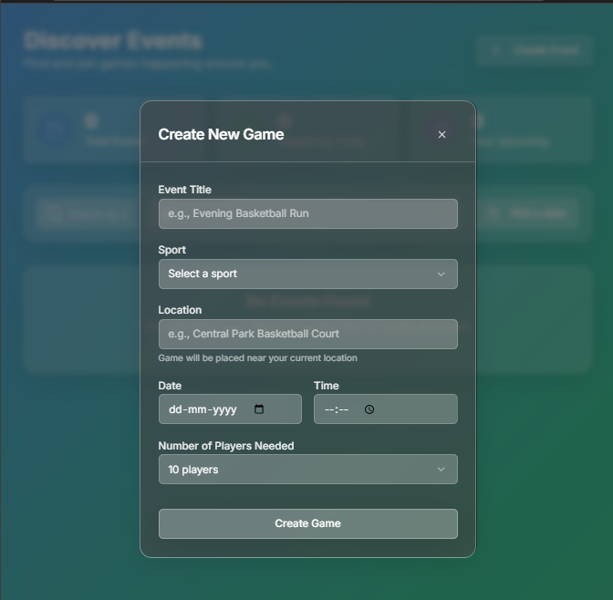

# Local Event Discovery Platform
# Huddle

Welcome to the Local Event Discovery Platform! This is a modern, full-stack web application designed to help users find, join, and discuss local events happening around them. It features an interactive map, real-time chat, and a clean, component-based architecture.




## ✨ Key Features

*   **🗺️ Interactive Map View**: Discover events visually on a Google Map.
*   **👤 User Authentication**: Secure sign-up and login functionality powered by Firebase Authentication.
*   **🎉 Event Management**: Users can create new events, and RSVP to events organized by others.
*   **💬 Real-Time Chat**: Every event has a dedicated real-time chat room for attendees to communicate.
*   **✉️ Centralized Chat Page**: A dedicated page to view and manage conversations for all your joined and organized events.
*   **👤 User Profile**: A clean profile page with a tabbed view to easily see events you've organized versus those you've joined.
*   **📱 Responsive Design**: A modern, responsive UI built with Tailwind CSS and Shadcn/ui.

## 🚀 Tech Stack

This project is built with a modern, type-safe, and scalable technology stack.

*   **Framework**: [Next.js](https://nextjs.org/) (with App Router)
*   **Language**: [TypeScript](https://www.typescriptlang.org/)
*   **Backend & Database**: [Firebase](https://firebase.google.com/) (Firestore, Firebase Authentication)
*   **UI Components**: [Shadcn/ui](https://ui.shadcn.com/), built on Radix UI
*   **Styling**: [Tailwind CSS](https://tailwindcss.com/)
*   **Mapping**: [Google Maps Platform](https://developers.google.com/maps)
*   **Package Manager**: [PNPM](https://pnpm.io/)

## ⚙️ Getting Started

Follow these instructions to get the project up and running on your local machine.

### Prerequisites

*   Node.js (v18 or later)
*   PNPM installed (`npm install -g pnpm`)
*   A Firebase project with Firestore and Authentication enabled.
*   A Google Cloud Platform project with the Maps JavaScript API enabled.

### 1. Clone the Repository

```bash
git clone https://github.com/your-username/your-repo-name.git
cd your-repo-name
```

### 2. Install Dependencies

```bash
pnpm install
```

### 3. Set Up Environment Variables

You will need to create a `.env.local` file in the root of the project. This file will store your secret keys for Firebase and Google Maps.

Rename the `env.local.example` file (if present) to `.env.local`, or create it from scratch with the following content:

```
# Firebase Client SDK Configuration
# These keys are safe to expose on the client side
NEXT_PUBLIC_FIREBASE_API_KEY=
NEXT_PUBLIC_FIREBASE_AUTH_DOMAIN=
NEXT_PUBLIC_FIREBASE_PROJECT_ID=
NEXT_PUBLIC_FIREBASE_STORAGE_BUCKET=
NEXT_PUBLIC_FIREBASE_MESSAGING_SENDER_ID=
NEXT_PUBLIC_FIREBASE_APP_ID=

# Firebase Admin SDK Configuration (for server-side code)
# Keep these secret! Do not expose them to the client.
FIREBASE_PROJECT_ID=
FIREBASE_CLIENT_EMAIL=
FIREBASE_PRIVATE_KEY=

# Google Maps API Key
# This key is used for loading the map on the client side
NEXT_PUBLIC_MAPS_API_KEY=
```

### 4. Run the Development Server

```bash
pnpm dev

or npm run dev
```

The application should now be running at [http://localhost:3000](http://localhost:3000).

## 📂 Project Structure

The project follows the standard Next.js App Router structure, with a clear separation of concerns.

```
/
├── app/                      # Main application folder (pages and API routes)
│   ├── api/                  # Backend API routes
│   └── (main)/               # Route group for main app pages (profile, etc.)
├── components/               # Reusable React components
│   ├── ui/                   # UI components from Shadcn/ui
│   └── (feature)/            # Components specific to features (events, chat, etc.)
├── lib/                      # Core logic, Firebase SDK setup, and utility functions
├── public/                   # Static assets (images, logos)
├── firebase.json             # Firebase hosting and services configuration
├── firestore.rules           # Security rules for the Firestore database
└── package.json              # Project dependencies and scripts
```

## Recent Updates

The project is under active development. Recent efforts (mid-August) have focused on:
*   **Feature Expansion**: Rolled out a dedicated chat system and redesigned the events and profile pages.
*   **Stabilization**: Resolved dependency conflicts related to React 19, fixed incorrect package versions, and corrected module import/export errors across the codebase to ensure a stable and reliable development experience.

---
This README was generated with assistance from an AI code agent.
```