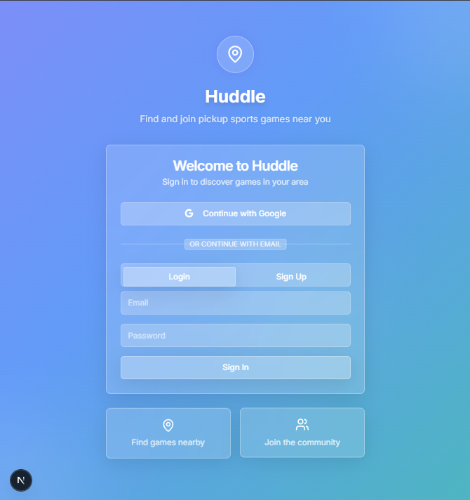
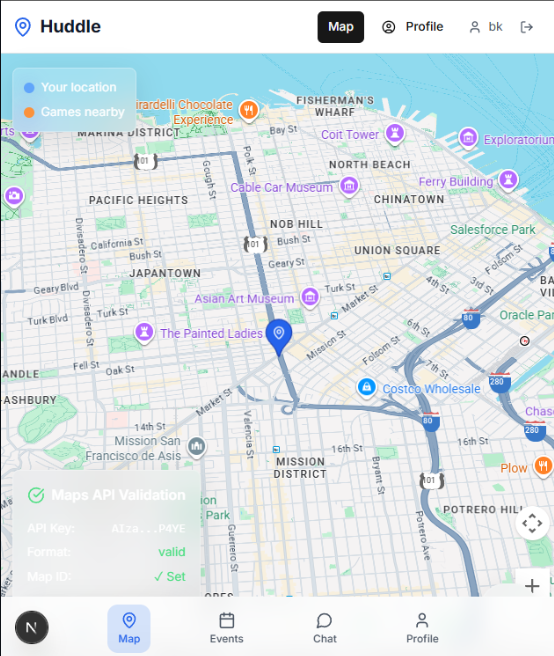
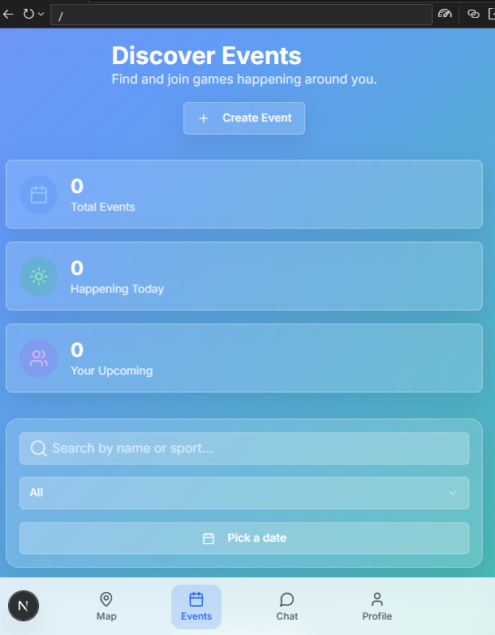
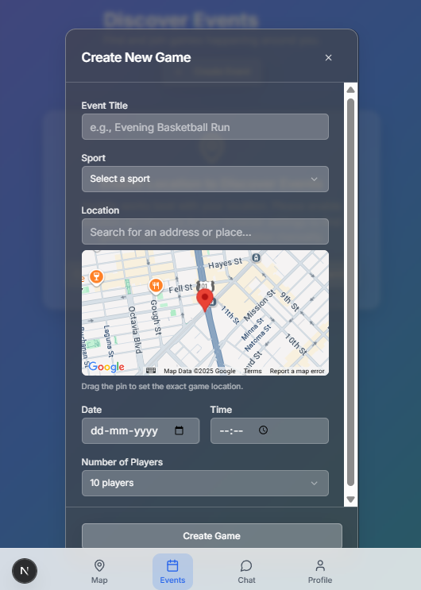
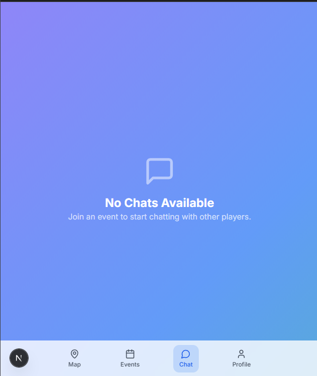

# Huddle - V1 Stable

Huddle is a modern, full-stack web application designed to help users discover, create, and join local pickup sports events. Centered around an interactive map, it provides a seamless experience for finding nearby games, creating events with precise locations, and engaging with other participants through real-time chat.

This V1 release is feature-complete and stable, showcasing a scalable backend architecture and a polished, user-friendly "glassmorphism" UI.

| Login/Signup | Discover Events | Events Page |
| :---: | :---: | :---: |
|  |  |  |

| Events search | Create Event | Chat |
| :---: | :---: | :---: |
|  |  |  |

| Profile |
| :---: |
|  |

## Key Features

*   **Interactive Geospatial Search**: Users can discover events in their vicinity, powered by efficient geospatial queries using geohashing.
*   **Dynamic, Client-Side Filtering**: A fast and responsive UI allows users to instantly filter nearby events by sport, date, time, and availability without re-fetching data.
*   **Advanced Event Creation**: A completely overhauled event creation modal featuring an interactive map, a draggable pin for precise location setting, and Google Places Autocomplete for address searching.
*   **Real-Time Event Chat**: Each event includes a real-time chat for registered participants to coordinate and communicate.
*   **Social Sign-In**: Streamlined user onboarding with support for both traditional email/password and one-click Google Sign-In.
*   **User Profiles**: A dedicated profile page where users can view their organized and joined events.
*   **Modern UI/UX**: A beautiful "glassmorphism" design system built with Tailwind CSS and Shadcn/ui, featuring professional skeleton loading states for a smooth user experience.

## Tech Stack

| Category      | Technology                                                                                             |
| :------------ | :----------------------------------------------------------------------------------------------------- |
| **Framework** | [**Next.js**](https://nextjs.org/) (v15+ with App Router)                                                |
| **Language**  | [**TypeScript**](https://www.typescriptlang.org/)                                                      |
| **Backend**   | [**Firebase**](https://firebase.google.com/) (Serverless: Auth, Firestore)                             |
| **Geospatial**| [**Google Maps Platform**](https://developers.google.com/maps) & [**`geofire-common`**](https://github.com/firebase/geofire-js) |
| **Styling**   | [**Tailwind CSS**](https://tailwindcss.com/) & [**Shadcn/ui**](https://ui.shadcn.com/)                   |
| **Deployment**| [**Vercel**](https://vercel.com/) (Frontend) & [**Firebase**](https://firebase.google.com/) (Backend)    |
| **Package Manager**| [**PNPM**](https://pnpm.io/)                                                                           |

---

## Getting Started

Follow these instructions to get the project running on your local machine for development and testing purposes.

### 1. Prerequisites

Ensure you have the following installed:
*   [Node.js](https://nodejs.org/) (v18 or later)
*   [PNPM](https://pnpm.io/installation)

### 2. Clone the Repository

```bash
git clone https://github.com/bkrishnanair/huddle_v0.git
cd huddle_v0
```

### 3. Set Up Environment Variables

This project requires API keys from both Firebase and Google Cloud to function.

1.  Create a `.env.local` file in the root of the project:
    ```bash
    touch .env.local
    ```
2.  Add the following environment variables to the file, replacing the placeholders with your actual project credentials:
    ```env
    # Firebase Configuration
    NEXT_PUBLIC_FIREBASE_API_KEY=your_firebase_api_key
    NEXT_PUBLIC_FIREBASE_AUTH_DOMAIN=your_firebase_auth_domain
    NEXT_PUBLIC_FIREBASE_PROJECT_ID=your_firebase_project_id
    NEXT_PUBLIC_FIREBASE_STORAGE_BUCKET=your_firebase_storage_bucket
    NEXT_PUBLIC_FIREBASE_MESSAGING_SENDER_ID=your_firebase_messaging_sender_id
    NEXT_PUBLIC_FIREBASE_APP_ID=your_firebase_app_id

    # Google Maps Configuration
    NEXT_PUBLIC_GOOGLE_MAPS_API_KEY=your_google_maps_api_key
    NEXT_PUBLIC_GOOGLE_MAPS_MAP_ID=your_google_maps_map_id
    ```
    > **Note:** For the Google Maps API Key, ensure you have enabled the **Maps JavaScript API**, **Places API**, and **Geocoding API** in your Google Cloud Console.

### 4. Install Dependencies and Run

This project uses `pnpm`. The repository includes an `.npmrc` file to automatically handle peer dependency issues during installation.

```bash
# Install all project dependencies
pnpm install

# Run the development server
pnpm run dev
```

The application should now be running on [http://localhost:3000](http://localhost:3000).

---

## Key Architectural Decisions

This project has been architected with performance and scalability in mind. Here are some of the key technical decisions:

*   **Scalability (Geospatial Queries)**: The project has moved from a naive "fetch all" approach to a highly scalable one. By calculating and storing a `geohash` for each event, the backend can now query for events within a specific geographic area without having to check every single document in the database. This is the correct, production-grade way to build a location-aware application.

*   **Performance (Data Denormalization)**: To speed up the UI, event documents are now created with `organizerName` and `organizerPhotoURL` saved directly on them. This is a classic denormalization strategy that avoids the need for the client to make a second database request for the organizer's profile for every event card it displays, significantly reducing latency and database reads.

*   **User Experience (Client-Side Filtering)**: The "Discover Events" page stores the fetched nearby events in a master state (`allNearbyEvents`). When a user interacts with filters, a derived state (`filteredEvents`) is instantly recalculated on the client, providing a fast and responsive UI without any additional network requests.

---
This README was last updated with assistance from an AI code agent.
