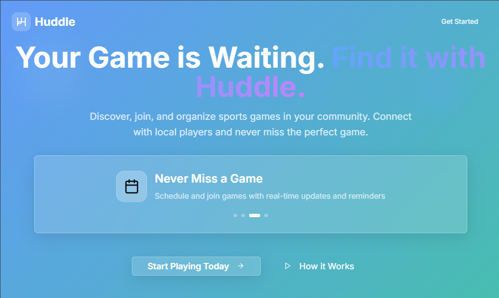
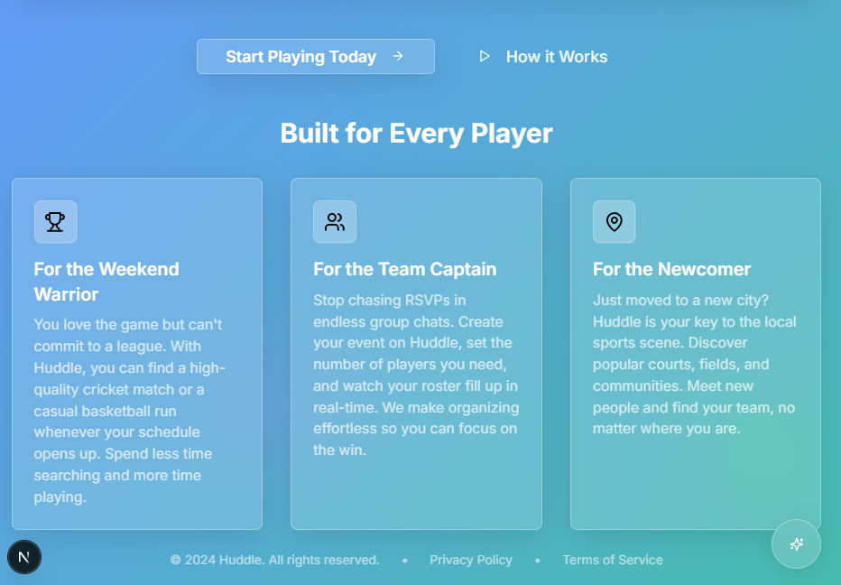
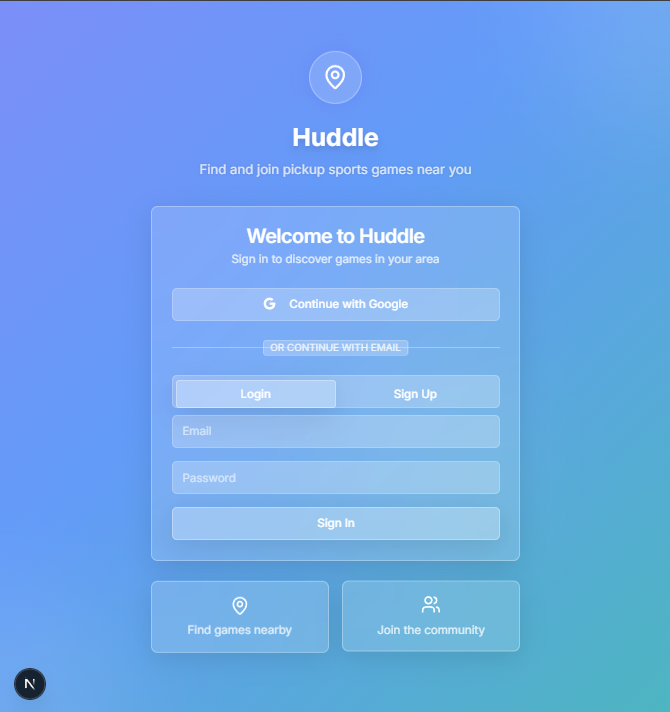
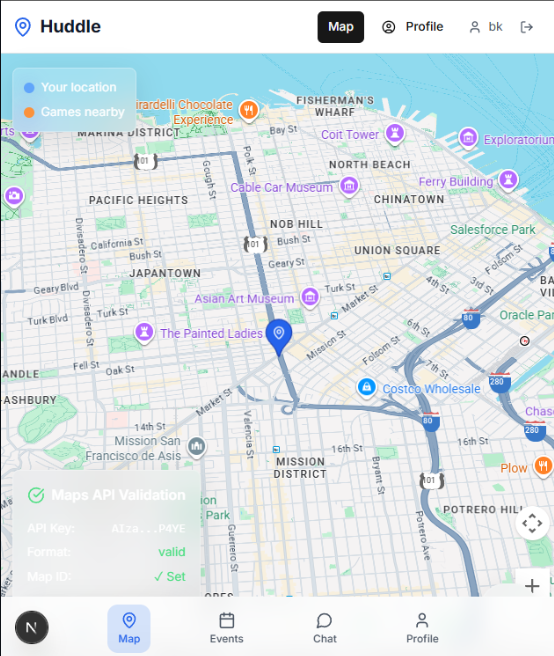
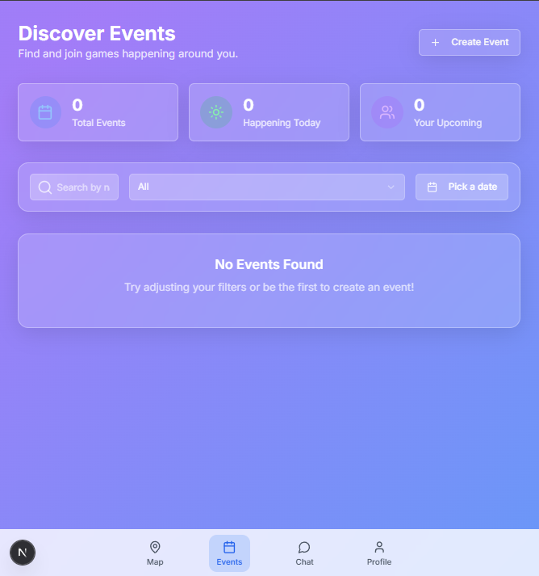
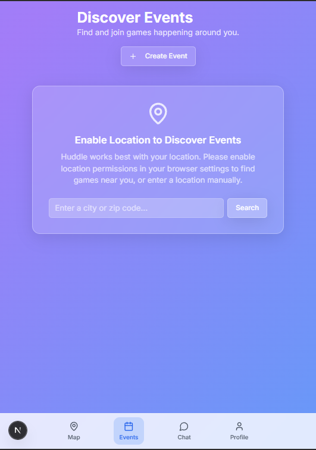
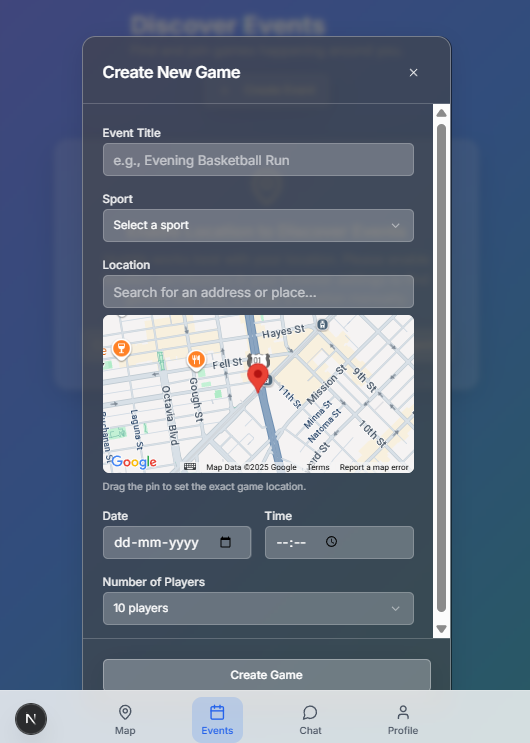
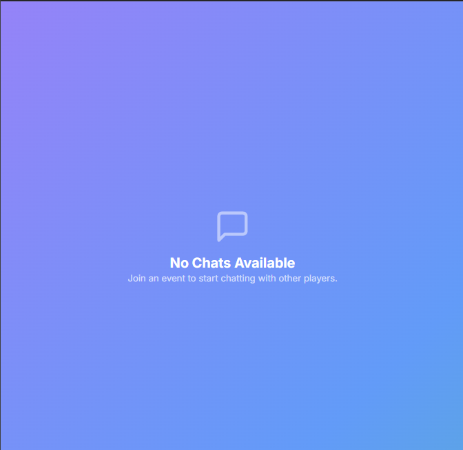
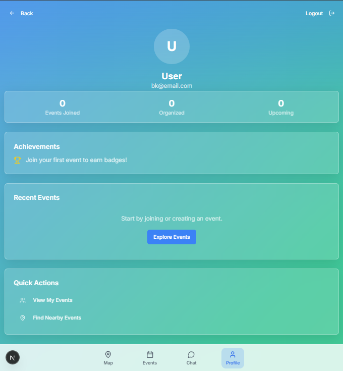

# Huddle - V2 Enhanced

Huddle is a modern, full-stack web application designed to help users discover, create, and join local pickup sports events. Centered around an interactive map, it provides a seamless experience for finding nearby games, creating events, and engaging with other participants through real-time chat, social profiles, and automated reminders.

This V2 release enhances the stable V1 foundation with social connectivity features, gamification, and a hardened, production-ready backend, creating a more engaging and resilient user experience.

## Screenshots

| Landing Page 1 | Landing Page 2 | Login/Signup |
| :---: | :---: | :---: |
|  |  |  |

| Discover Events | Events Page | Event Search |
| :---: | :---: | :---: |
|  |  |  |

| Create Event | Chat | Profile |
| :---: | :---: | :---: |
|  |  |  |

## Key Features
*   **Engaging User Profiles**: Users can personalize their profiles with a bio and favorite sports, turning their profile into a social hub.
*   **Social Connectivity**: A friend/connection system allows users to send and accept friend requests, fostering a sense of community.
*   **Gamification & Achievements**: Users are rewarded with badges for reaching milestones, such as joining their first game.
*   **Automated Push Notifications**: All RSVP'd users automatically receive a reminder notification 30 minutes before an event is scheduled to start, powered by a scheduled Firebase Cloud Function.
*   **Interactive Map & Event Discovery**: Users can discover events in their vicinity, powered by an interactive map with custom-styled pins.
*   **Advanced Event Creation**: Create single or recurring events with a powerful and user-friendly modal that includes robust, server-side validation.
*   **RSVP & Real-Time Check-in**: Users can RSVP for events with a single click. Event organizers have a dedicated "Players" tab to view the attendee list and check players in in real-time.
*   **Real-Time Event Chat**: Each event includes a real-time chat for participants to coordinate and communicate.
*   **Modern UI/UX**: A beautiful "glassmorphism" design system built with Tailwind CSS and Shadcn/ui, featuring a global notification system for user feedback.

## Tech Stack

| Category      | Technology                                                                                             |
| :------------ | :----------------------------------------------------------------------------------------------------- |
| **Framework** | [**Next.js**](https://nextjs.org/) (App Router) & [**React 18**](https://react.dev/) |
| **Language**  | [**TypeScript**](https://www.typescriptlang.org/)                                                      |
| **Backend**   | [**Firebase**](https://firebase.google.com/) (Serverless: Admin SDK, Auth, Firestore, Cloud Functions)   |
| **Validation**| [**Zod**](https://zod.dev/) (for server-side data validation)                                            |
| **Mapping**   | [**Google Maps Platform**](https://developers.google.com/maps) (Modern Places API)                     |
| **Styling**   | [**Tailwind CSS**](https://tailwindcss.com/) & [**Shadcn/ui**](https://ui.shadcn.com/)                   |
| **Deployment**| [**Vercel**](https://vercel.com/) (Frontend) & [**Firebase**](https://firebase.google.com/) (Backend)    |
| **Package Manager**| [**PNPM**](https://pnpm.io/)                                                                           |

---

## Getting Started

Follow these instructions to get the project running on your local machine for development and testing purposes.

### 1. Prerequisites

Ensure you have the following installed:
*   [Node.js](https://nodejs.org/) (v18 or later)
*   [PNPM](https://pnpm.io/installation)
*   [Firebase CLI](https://firebase.google.com/docs/cli)

### 2. Clone the Repository

\`\`\`bash
git clone https://github.com/bkrishnanair/huddle_v0.git
cd huddle_v0
\`\`\`

### 3. Set Up Environment Variables

This project requires API keys from Firebase and Google Cloud to function.

1.  Create a `.env` file in the root of the project:
    \`\`\`bash
    touch .env
    \`\`\`
2.  Add the following environment variables to the file, replacing the placeholders with your actual project credentials. You can get the Admin SDK credentials from the Firebase Console under Project Settings > Service accounts.
    \`\`\`env
    # Firebase Client SDK Configuration (for the browser)
    NEXT_PUBLIC_FIREBASE_API_KEY=your_firebase_api_key
    NEXT_PUBLIC_FIREBASE_AUTH_DOMAIN=your_firebase_auth_domain
    NEXT_PUBLIC_FIREBASE_PROJECT_ID=your_firebase_project_id
    NEXT_PUBLIC_FIREBASE_STORAGE_BUCKET=your_firebase_storage_bucket
    NEXT_PUBLIC_FIREBASE_MESSAGING_SENDER_ID=your_firebase_messaging_sender_id
    NEXT_PUBLIC_FIREBASE_APP_ID=your_firebase_app_id
    NEXT_PUBLIC_FIREBASE_VAPID_KEY=your_fcm_vapid_key

    # Google Maps Configuration
    NEXT_PUBLIC_GOOGLE_MAPS_API_KEY=your_google_maps_api_key
    NEXT_PUBLIC_GOOGLE_MAPS_MAP_ID=your_google_maps_map_id

    # Firebase Admin SDK Configuration (for the server)
    FIREBASE_PROJECT_ID=your_firebase_project_id
    FIREBASE_CLIENT_EMAIL=your_service_account_client_email
    FIREBASE_PRIVATE_KEY="your_service_account_private_key"
    \`\`\`
    > **Note:** For the Google Maps API Key, ensure you have enabled the **Maps JavaScript API**, **Places API**, and **Geocoding API** in your Google Cloud Console.

### 4. Install Dependencies and Run

The repository includes an `.npmrc` file to automatically handle peer dependency issues during installation.

\`\`\`bash
# Install root project dependencies
pnpm install

# Run the development server
pnpm run dev
\`\`\`

The application should now be running on [http://localhost:3000](http://localhost:3000).

---

## Core Architectural Decisions

This project has been architected with a modern, secure, and scalable structure.

*   **Secure by Default (Route Groups)**: The Next.js App Router's Route Groups are used to create a clear separation between public routes (the landing/login page) and private, authenticated routes (`/map`, `/events`, etc.). A secure layout file acts as a gateway, automatically redirecting unauthenticated users to the login page.
*   **Cohesive UI/UX:** A new, consistent design system has been implemented using a "glassmorphism" aesthetic. All colors, typography, and component styles are defined as tokens in `tailwind.config.ts` and `globals.css`.
*   **Server-Side Validation**: All critical API endpoints are secured with Zod schemas, ensuring that only valid data reaches the database.
*   **Hybrid Data Fetching**: The app uses a hybrid model. Secure actions (like creating an event or sending a message) are handled by server-side API Routes, while real-time data (like chat messages) is streamed directly to the client using Firestore's `onSnapshot` listeners for maximum performance.
*   **Performance (Data Denormalization)**: The Firestore schema uses denormalization for key relationships. For example, the `players` and `checkedInPlayers` arrays are stored directly on an event document. This avoids costly database joins and significantly speeds up data retrieval for common user flows.
*   **Robust Server-Side Architecture**: The Firebase Admin SDK is initialized using a lazy-loaded singleton pattern. This ensures that the server's connection to Firebase is established reliably and efficiently, preventing crashes and authentication failures. All authenticated routes are protected by a centralized `verifySession` guard, which provides consistent security and error handling.
---
