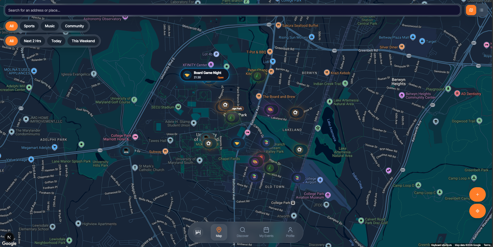
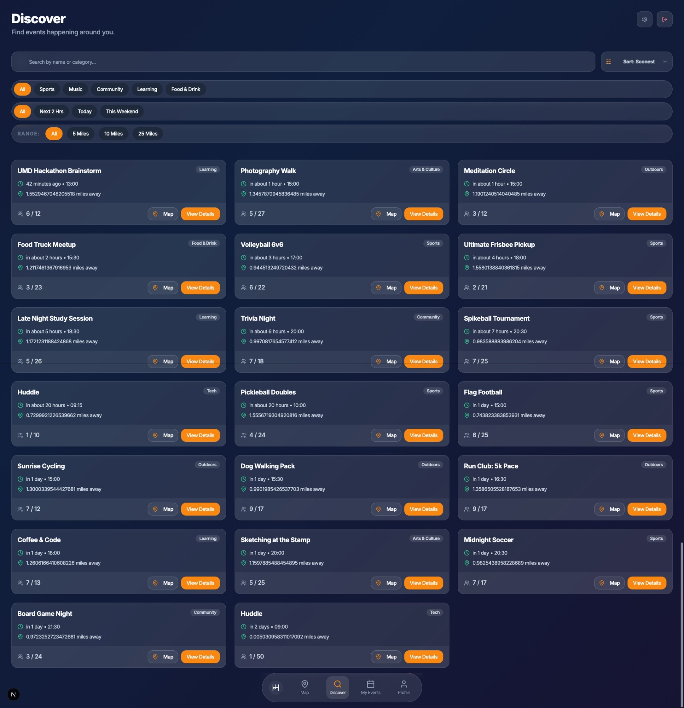

# Huddle - V3.0 Enhanced

Huddle is a modern, full-stack web application designed to help users discover, create, and join local pickup sports events. Centered around an interactive map, it provides a seamless experience for finding nearby games, creating events, and engaging with other participants through real-time chat, social profiles, and automated reminders.

This production-ready application features a complete authentication system, real-time event management, and interactive social features, creating an engaging and reliable user experience for sports enthusiasts.

| Landing Page | Maps Feed | Discover |
| :---: | :---: | :---: |
|  |  |  |

| My Events | Create Event | Profile |
| :---: | :---: | :---: |
|  |  |  |

---

## 🚀 Key Features & Functionality

### 🌍 Frictionless Guest Access & Discovery
*   **Live Interactive Map**: Unauthenticated users can instantly explore the live map and Discover feed. 
*   **Premium Map Pins**: Custom React teardrop nodes featuring rich gradients, drop shadows, and scale-on-hover micro-animations. Categorizes events via custom emojis. **Zoom-adaptive sizing** — pins shrink at low zoom to reduce overlap and improve click accuracy.
*   **Discovery Filters**: Surface events happening "Live", "This Week", or "This Weekend" with a single tap. Collapsible "More Filters" panel for Range and Date Range to keep the UI clean.
*   **Virtual & Hybrid Events**: Create events as In-Person, Virtual (Zoom/Meet link), or Hybrid. Virtual events hide the map picker and show a meeting link field instead.
*   **Cloud Console Styling**: Map visual themes (like Dark Mode and Point of Interest decluttering) are natively controlled via Google Cloud Map IDs without local style overrides.


### 📊 Organizer Logistics & CRM (Organizer Studio)
*   **Organizer Dashboard**: High-level analytics to track event performance, total RSVPs, and average show rates.
*   **Advanced RSVP Logic**: Require answers to custom logistics questions ("Dietary restrictions?") and force selection of specific **Pickup Points**. Save and delete question presets.
*   **CSV Exports**: One-click roster downloads now include attendee notes, question responses, and checkout flags.
*   **One-Click Cloning**: Instantly duplicate repetitive events while safely blanking date/time fields to prevent scheduling overlaps.
*   **📍 Use Current Location**: One-tap GPS button in the event creation form auto-fills the address via reverse geocoding.

### 👥 Reliability & Trust Signal
*   **Live Check-Ins**: Organizers can open check-in at the event start; attendees use "self-check-in" to verify presence.
*   **Reliability Score**: Public profiles now feature a calculated "Show Rate" based on historical check-in data to reduce no-shows.
*   **Smart Waitlists (Atomic)**: Built-in waitlist system preventing over-selling. Uses `adminDb.runTransaction()` to safely handle overflow and automatic promotion when a slot becomes available.

### 🛡️ Safety & Moderation Layer
*   **User Blocking**: Organizers can block problematic users from seeing or joining their future events.
*   **Reporting Suite**: Users can report events, profiles, or gallery photos for administrative review.
*   **Event Photo Gallery**: Shared memory spaces post-event. Contributors can upload photos (< 10MB) to preserve the game's highlights. Includes upload cancel functionality.
*   **📊 Most Joined Categories**: Profile page shows your top 3 most-joined event categories with emoji icons and counts.
*   **🎯 Smart Recommended Filter**: Map and Discover "Recommended" filter merges your profile interests with your top joined categories for personalized event discovery.

### 🌐 Social Graph & Serendipity Engine
*   **Atomic Follow System**: Users can build their network by following active organizers and friends. Transactions securely synchronize follower/following counts globally.
*   **Optimized Social Proof**: Event cards instantly highlight `"🔥 N friends attending"` if someone in your network RSVPs.
*   **The Serendipity Filter**: A highly-targeted algorithm that evaluates physical distance (`geofire-common`) and declared user interests to ping followers with high-urgency app notifications ("`🔥 Your friend is playing basketball near you! Join them?`") when relevant games are created. Location tracking is aggressively debounced on the client to drastically conserve database writes.

### 💬 Real-Time Communication & Automation
*   **Live Event Chat**: Instant messaging for all confirmed participants with **Pinned Announcements** from the host.
*   **In-App Notifications**: Near real-time alerts for waitlist promotions, event changes, and host updates.
*   **Automated Scheduling (Cron)**: Vercel Cron jobs automatically broadcast scheduled messages to the event chat at pre-defined intervals.

---

## 🛠️ Tech Stack

| Category      | Technology                                                                                             |
| :------------ | :----------------------------------------------------------------------------------------------------- |
| **Framework** | [**Next.js**](https://nextjs.org/) (v15 App Router) & [**Turbopack**](https://turbo.build/pack)        |
| **Language**  | [**TypeScript**](https://www.typescriptlang.org/) (Strictly typed with `GameEvent` interfaces)         |
| **Backend**   | [**Firebase**](https://firebase.google.com/) (Auth, Firestore, Admin SDK, Storage)                     |
| **Validation**| [**Zod**](https://zod.dev/) (Strict server-side validation)                                            |
| **Mapping**   | [**Google Maps Platform**](https://developers.google.com/maps) (`@vis.gl/react-google-maps`)           |
| **Styling**   | [**Tailwind CSS**](https://tailwindcss.com/) & [**Shadcn/ui**](https://ui.shadcn.com/)                 |
| **Deployment**| [**Vercel**](https://vercel.com/) (Frontend edge network & Cron jobs)                                  |

---

## 🤝 Getting Started

### 1. Installation
1.  Clone the repository.
2.  Install dependencies: `pnpm install`.
3.  Configure `.env.local` using the template provided in the documentation.

### 2. Local Data Seeding
To populate your local map with realistic, UMD-specific events (centered around the March 3rd – 30th range), run the idempotent seeding suite:
```bash
npx ts-node scripts/seed_umd.ts
```

### 3. Run Development Server
```bash
pnpm run dev
```

---

## 📂 Internal Documentation

For more detailed guides, please refer to our **Documentation** folder:
- [DATABASE.md](./Documentation/DATABASE.md): Schema and core collections.
- [API_ROUTES.md](./Documentation/API_ROUTES.md): Reference for all Next.js 15 endpoints.
- [SECURITY.md](./Documentation/SECURITY.md): Dual-Auth and Atomic Transaction model.
- [ARCHITECTURE.md](./Documentation/ARCHITECTURE.md): System design and spatial rendering strategies.
- [DEPLOYMENT.md](./Documentation/DEPLOYMENT.md): Guide for deploying to Vercel/Firebase.
- [DEVELOPER_GUIDE.md](./Documentation/DEVELOPER_GUIDE.md): Local setup and coding standards.
